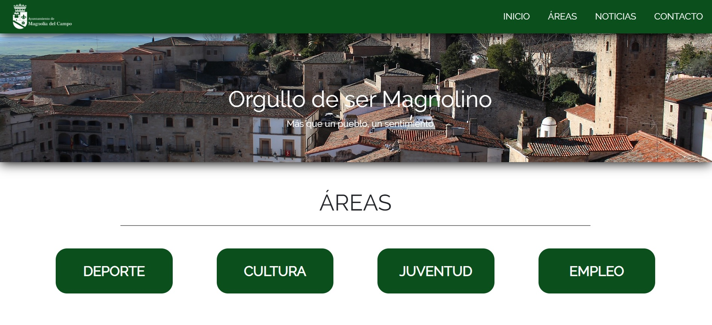
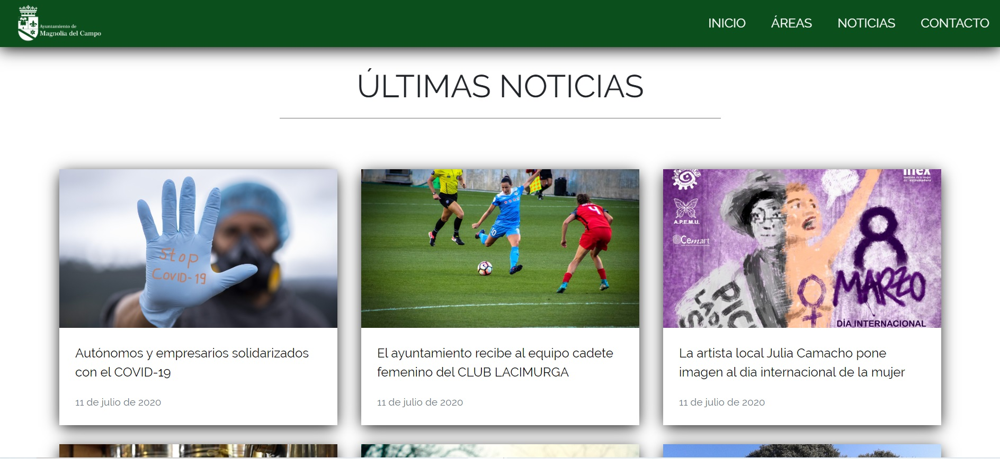
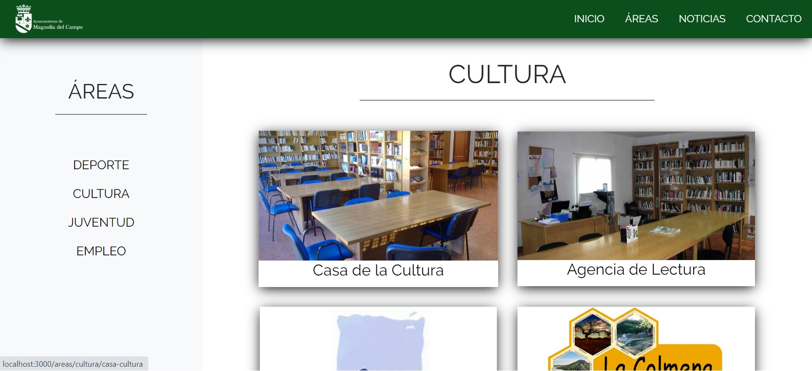
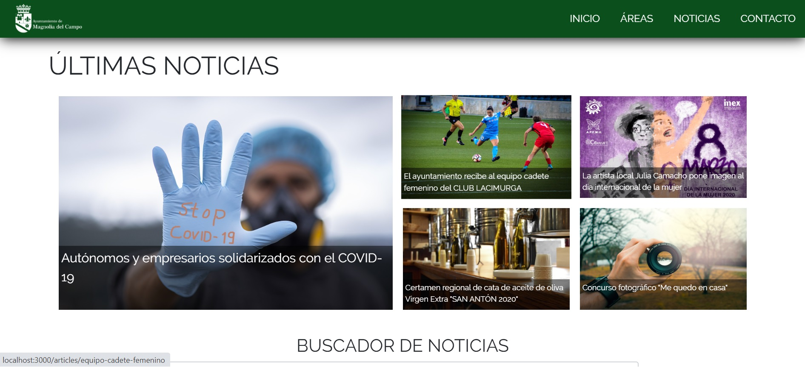

AYUNTAMIENTO

This is my first project as Web Developer, it shows the web page of the fictional town of 'Magnolia del Campo'. The website is a responsive SPA, developed with 'React', in which you can find a main page, four areas pages, a news page in which you can search articles and a contact page. This project is not developed for comercial use, it is my personal project for the 'React' course that I just finished.

The main external resources and libraries used for his project are: 

-- Firebase ( Firestore, Storage, Authentication and Hosting ) 
-- REDUX ('Ducks') 
-- Google Fonts( Raleway ) 
-- Bootstrap 
-- MomentJS 
-- FontAwesome 

See the project running in the following link:

https://ayuntamiento-2a2a8.firebaseapp.com/

Screen captures:

This project is not finished, there are meny more things that should be included and changed, like the article cards placed at the right side of the article page. It also has an 'Admin' page, that can't be showed here, where you could do CRUD (Create, Read, Update, Delete) operations for articles.

Thank you very much for your time